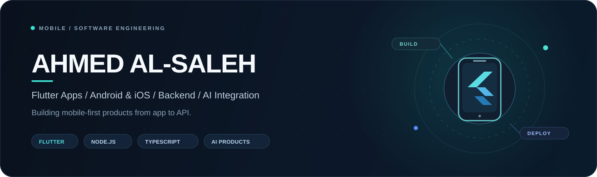
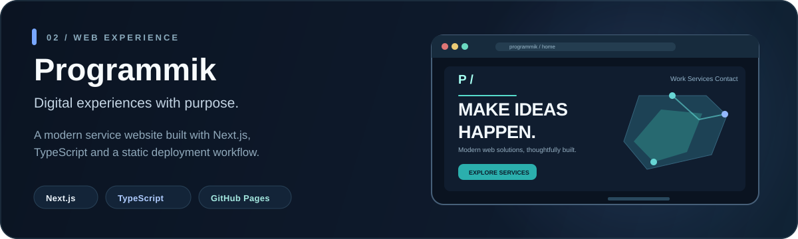

 

**Mobile & Software Engineer** · Flutter / Dart · Backend · AI Integration

I build production-focused mobile applications for Android and iOS, with the backend systems and AI capabilities behind them.

  

<a href="https://ahmedalsaleh.github.io/my-portfolio/">Portfolio ↗</a>&nbsp;&nbsp;·&nbsp;&nbsp;
<a href="mailto:Asmlahmd15@gmail.com">Email ↗</a>&nbsp;&nbsp;·&nbsp;&nbsp;
<a href="https://wa.me/963992086301">WhatsApp ↗</a>

 

### Tech stack

**Mobile-first engineering**, supported by backend systems, AI integrations, and web delivery.

#### 📱 Mobile application development

 

 

**Flutter & Dart** · Android & iOS · Cross-platform apps · Firebase · Maps · Push notifications · Real-time features

#### ⚙️ Backend, APIs & cloud

 

**Node.js & TypeScript** · REST APIs · Authentication · WebSockets · Databases · Server-side architecture

#### 🤖 AI engineering & integration

 

LLM integration · Document processing · AI-powered study tools · RAG workflows

#### 🌐 Web development & engineering tools

 

React · Next.js · Git · GitHub · Docker · API testing · CI/CD

 

### Featured applications & projects

Selected products — real project links, with custom illustrated previews.

📱 **Revizo · Flutter Mobile App** — AI-assisted study experience built with Flutter, Node.js / TypeScript and Supabase. Students can work with PDF learning materials, summaries and practice questions.  
[View on Google Play ↗](https://play.google.com/store/apps/details?id=com.revizo.ahmed.dose.programmik.www.mobile_app) &nbsp;·&nbsp; Source code is private.

 

🌐 **Programmik** — Next.js website showcasing digital services, built with TypeScript and published via GitHub Pages.  
[Live website ↗](https://ahmedalsaleh.github.io/programmik/) &nbsp;·&nbsp; [Source code ↗](https://github.com/ahmedAlSaleh/programmik)

 

### More engineering work

Backend APIs, dashboards, product interfaces and production-oriented web projects.

| Project | Focus |
| :--- | :--- |
| ⚙️ [Souqli Backend API](https://github.com/ahmedAlSaleh/souqli_bscckend) | Node.js · Express · MySQL · JWT · RBAC |
| 🧩 [Souqli Admin Panel](https://github.com/ahmedAlSaleh/souqli-admin-panel) | Administration interface |
| 🍽️ [Al Qaisar Restaurant](https://github.com/ahmedAlSaleh/Al-Qaisar-Restaurant) | Restaurant website |
| 🍽️ [Al Rayyan Restaurant](https://github.com/ahmedAlSaleh/al-rayyan-restaurant) | Next.js restaurant website |
| 💬 [Dialora Website](https://github.com/ahmedAlSaleh/Dialora-web-site) | React · Vite |
| 📣 [Advertising Platform](https://github.com/ahmedAlSaleh/advertising-user_sb) | Advertising application frontend |
| 🛒 [Store Control Panel](https://github.com/ahmedAlSaleh/my_stor_control_panel) | Store management interface |

[**Explore all repositories ↗**](https://github.com/ahmedAlSaleh?tab=repositories)

 

---

**Open to remote software engineering opportunities and selected freelance work.**

[Portfolio](https://ahmedalsaleh.github.io/my-portfolio/) &nbsp;·&nbsp; [GitHub](https://github.com/ahmedAlSaleh) &nbsp;·&nbsp; [Get in touch](mailto:Asmlahmd15@gmail.com)

Designed around shipped work, clear technical focus, and real project links.

